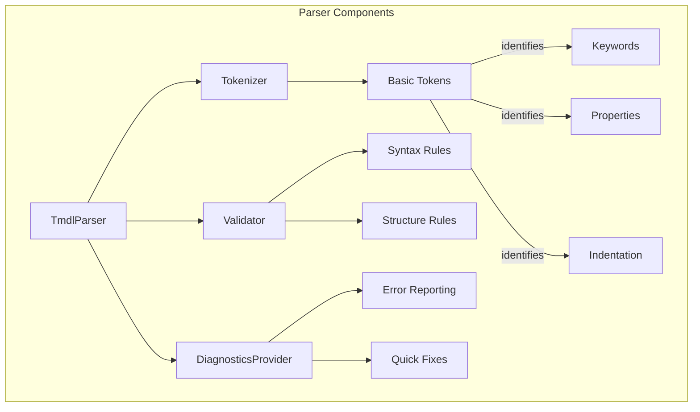

# TMDL Parser Architecture

This document outlines the architecture and implementation plan for a lightweight TMDL (Tabular Model Definition Language) parser designed for VS Code extension integration.

## Overview

The TMDL parser is designed to provide basic syntax validation and structure checking for TMDL files within VS Code. It focuses on essential validation features while maintaining good performance for real-time editor feedback.

## Components

### 1. Parser Components



#### 1.1 Tokenizer

- Breaks TMDL content into basic tokens
- Tracks indentation levels
- Identifies key elements:
  - Keywords (database, model, table, etc.)
  - Properties and their values
  - Comments (triple-slash)
  - String literals

#### 1.2 Validator

- Validates basic syntax rules
- Checks structural consistency
- Verifies indentation hierarchy
- Ensures proper property formats

#### 1.3 DiagnosticsProvider

- Generates VS Code diagnostics
- Provides clear error messages
- Enables quick fixes where possible

### 2. Project Structure

```
src/
├── parser/
│   ├── tokenizer.ts      # Basic token extraction
│   ├── validator.ts      # Syntax validation
│   ├── diagnostics.ts    # Error reporting
│   └── types.ts         # Common types/interfaces
├── extension.ts          # Main extension file
└── test/
    └── parser.test.ts    # Parser unit tests
```

### 3. Key Interfaces

```typescript
interface Token {
    type: TokenType;
    value: string;
    line: number;
    column: number;
    indent: number;
}

interface ParserDiagnostic {
    message: string;
    severity: DiagnosticSeverity;
    range: Range;
    source: string;
}

interface ValidationRule {
    validate(tokens: Token[]): ParserDiagnostic[];
}
```

## Implementation Plan

### Phase 1: Core Parser

1. Implement basic tokenizer
   - Token types definition
   - Indentation tracking
   - Simple token extraction

2. Create validator
   - Basic syntax rules
   - Indentation validation
   - Property format checking

### Phase 2: VS Code Integration

1. Set up diagnostics provider
   - Convert parser errors to VS Code diagnostics
   - Show errors in Problems panel

2. Implement document provider
   - Parse on document change
   - Cache parsing results
   - Provide formatting support

### Phase 3: Testing
1. Create unit tests
   - Tokenizer tests
   - Validator tests
   - Integration tests

2. Add example TMDL files
   - Basic examples
   - Edge cases
   - Error scenarios

## Validation Rules

The parser will validate:

1. **File Structure**
   - Correct top-level declarations
   - Proper object nesting
   - Valid property definitions

2. **Syntax**
   - Property format (`name: value` or `name = expression`)
   - String literals
   - Comments format

3. **Indentation**
   - Consistent indentation levels
   - Proper parent-child relationships
   - Valid block structure

## Error Reporting

Error messages will be:
- Clear and descriptive
- Include line/column information
- Suggest possible fixes where applicable

Example error formats:
```
Line 5: Invalid indentation level
Line 10: Missing property value after colon
Line 15: Unexpected token in property declaration
```

## Future Enhancements

Potential future improvements:
1. Semantic validation
2. Cross-file reference checking
3. Advanced formatting options
4. Code completion suggestions
5. Symbol provider for navigation